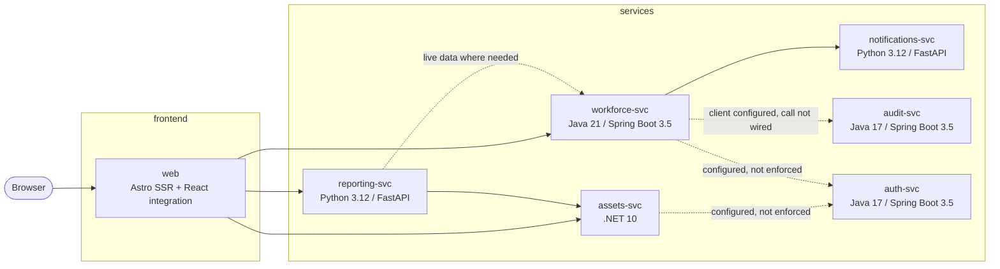

# AssetTrack architecture

AssetTrack is a teaching-oriented, polyglot microservices application for tracking hardware assets and employee assignments. The current runtime consists of one Astro SSR web application and six backend services. Services communicate with REST/JSON and are independently deployable.

## Runtime topology



## Service responsibilities

| Service | Responsibility | Entry point | Port |
|---|---|---|---:|
| `web` | Server-rendered UI and server-side composition of backend calls | `services/web/src/pages/*.astro` | 4321 |
| `assets-svc` | Asset CRUD, search, and status statistics | `services/assets-svc/Program.cs` | 5001 |
| `workforce-svc` | Employee and assignment management | `WorkforceApplication.java` | 5002 |
| `reporting-svc` | Warranty/utilization reports and CSV import | `services/reporting-svc/app/main.py` | 5003 |
| `notifications-svc` | Assignment webhook receiver and notification stubs | `services/notifications-svc/app/main.py` | 5004 |
| `audit-svc` | Append-only audit event log | `AuditApplication.java` | 5005 |
| `auth-svc` | User lookup, RS256 token issuance, and JWK publication | `AuthApplication.java` | 5006 |

## Data ownership

Stateful services use separate SQLite databases. There is no shared database and no cross-service transaction.

| Service | Store | Access pattern |
|---|---|---|
| `assets-svc` | `assets.db` | Dapper and handwritten SQL |
| `workforce-svc` | `workforce.db` | Spring Data JPA/Hibernate |
| `notifications-svc` | `notifications.db` | Python `sqlite3` event log |
| `audit-svc` | `audit.db` | Spring `JdbcTemplate` |
| `auth-svc` | `auth.db` | Spring `JdbcTemplate` |
| `reporting-svc` | None | Reads other services and writes imports through `assets-svc` |

Schemas are currently created or updated at startup. No shared migration/versioning strategy is in use; `workforce-svc` uses Hibernate schema update, while the other services initialize tables in application code.

## Request flows

### Dashboard

1. The browser requests `/` from `web`.
2. Astro server code calls `assets-svc` for status counts.
3. It calls `workforce-svc` for employee counts.
4. It calls `reporting-svc` for utilization.
5. The server renders the combined result as HTML.

### Asset reporting

`reporting-svc` calls `assets-svc` at request time. Warranty reports fetch the asset list; utilization reports fetch status counts. The reporting service does not maintain a reporting database or cache.

### CSV import

1. The web or a client uploads a CSV to `reporting-svc`.
2. `reporting-svc` converts each row into an asset request.
3. It POSTs the requests to `assets-svc`.
4. The current implementation aborts the entire request when a row or downstream request fails.

### Assignment notification

1. A client POSTs an assignment to `workforce-svc`.
2. `workforce-svc` checks that the asset has no active assignment.
3. It persists the assignment.
4. It synchronously POSTs a webhook to `notifications-svc`.
5. Notification failures are swallowed; there is no queue, retry, dead-letter handling, or idempotency mechanism.

### Audit logging

`workforce-svc` defines an audit `RestClient` and receives `AUDIT_SVC_URL`, but assignment creation and return currently do not POST events to `audit-svc`.

## Authentication status

`auth-svc` provides:

- `POST /token` for RS256 JWT issuance.
- `GET /.well-known/jwks` for public key discovery.
- `GET /users/{id}` for user lookup.

The current service code does not complete the intended authentication boundary:

- `assets-svc` receives `AUTH_JWKS_URL` but has no JWT authentication middleware.
- `workforce-svc` receives `AUTH_JWKS_URL` but has no JWT validation pipeline.
- The current web API client does not implement a login flow or consistently forward bearer tokens.
- The development configuration sets `DEV_TOKEN_MODE=true`, but the tracked frontend does not make that setting a substitute for a complete auth flow.

Treat the application as intentionally unauthenticated and insecure during development.

## Deliberate gaps and debt

The following are known teaching targets or current limitations:

- SQL injection in the raw-JDBC username and audit search queries.
- Plain-text seeded passwords in `auth-svc`.
- Missing JWT enforcement and authorization.
- Missing validation for asset creation and asset dates.
- Inactive employees can receive assignments.
- Return dates are not checked against assignment dates.
- CSV import has no row-level skip-and-summarize behavior.
- Notifications are best-effort with swallowed failures.
- Assignment audit calls are not wired.
- Audit and auth have no tests; reporting's tracked test directory contains only a README; notification coverage is absent.
- The web status badge maps `retired` and `lost` to the wrong Bootstrap colors.
- Startup schema management is inconsistent and lacks migrations.

These gaps are documented for course work. Do not deploy the application to the public internet or use it with sensitive data.

## Development and deployment

The root `package.json` starts all seven services with `concurrently`:

```bash
npm run dev
```

Docker Compose provides the alternative containerized flow:

```bash
docker compose up --build
```

The root development commands use local SQLite files below each service's `data/` directory. Compose uses one named volume per stateful service and maps backend container port `8080` to host ports `5001–5006`.

## Course branch tooling

`course-build/` is a generated learner-branch delta store, not part of the application runtime. Its workflows validate and promote generated branches/tags. Contributors should change `main` and let the maintained generation/promotion process produce learner branches.
