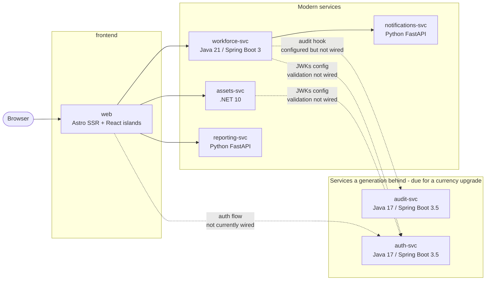

# AssetTrack (Contoso Industries)

> [!IMPORTANT]
> **Security Warning**
>
> This repository contains intentionally insecure code and an intentionally vulnerable application for educational and security-testing purposes only. Do not deploy it to production, expose it to the public internet, or run it on systems containing sensitive data. Use it only in an isolated, authorized environment, such as a sandbox or disposable virtual machine. You are responsible for preventing unauthorized access, misuse, or unintended impact on your systems and networks.

AssetTrack is Contoso Industries' internal application for tracking hardware assets (laptops, monitors, phones, badges, docking stations) and the employees they're assigned to. It is intentionally built as a **polyglot microservices** application so that course learners can practice agentic, Copilot-driven development across a realistic multi-language stack — including a couple of older Java services that still need modernization.

For a detailed description of service boundaries, data ownership, request flows, and current integration status, see [`ARCHITECTURE.md`](ARCHITECTURE.md).

## Architecture at a glance



All service-to-service calls use **REST/JSON**. Stateful services use separate SQLite databases; `reporting-svc` is a read-through service and does not own a primary database.

| Service              | Stack                                  | Port  | Owns                                |
|----------------------|----------------------------------------|-------|-------------------------------------|
| `web`                | Astro SSR + React integration + Bootstrap 5 | 4321  | UI, server-side API composition |
| `assets-svc`         | .NET 10 / ASP.NET Core minimal APIs | 5001  | Asset CRUD + search |
| `workforce-svc`     | Java 21 / Spring Boot 3.5 | 5002  | Employees + assignments |
| `reporting-svc`     | Python 3.12 / FastAPI | 5003  | Reports, CSV bulk import; no primary DB |
| `notifications-svc` | Python 3.12 / FastAPI | 5004  | Webhook receiver + SQLite event log |
| `audit-svc`         | Java 17 / Spring Boot 3.5 *(a generation behind)* | 5005 | Audit event log |
| `auth-svc`          | Java 17 / Spring Boot 3.5 *(a generation behind)* | 5006 | JWT issuer, JWKs, user lookup |

## Quick start (Codespaces or local devcontainer)

1. Open the repository in GitHub Codespaces, or in VS Code with the Dev Containers extension.
2. Wait for the devcontainer to finish provisioning. It installs:
   - Node 22, .NET 10, Python 3.12, Maven, and Java 21. The two currency-lagging Java services target Java 17 bytecode and build on the Java 21 JDK.
   - `concurrently` and editable Python installs for the FastAPI services (via `postCreateCommand`).
3. From the workspace root:

   ```bash
   npm run dev
   ```

   This starts all seven services as plain processes (no Docker required). A startup banner prints the URL. Run `npm run dev:verbose` if you need full log output instead of WARN-only.

4. Open http://localhost:4321 — that's the UI. Backend services listen on 5001–5006 if you want to hit them directly with `curl`.

## Quick start (local without a devcontainer)

You need Node 22, .NET 10, Python 3.12, Maven, and Java 21 on your machine. The legacy Java services target Java 17 bytecode but do not require a separate Java 17 installation. Then:

```bash
npm install
npm run install:all
npm run dev
```

## Running with Docker (optional)

A `docker-compose.yml` is still provided as an alternative to the dockerless workflow:

```bash
docker compose up --build
```

Open http://localhost:4321.

## Running a single service for development

Each service folder has its own `README.md` with native run instructions. The root `package.json` provides the multi-process development orchestrator and individual `dev:*` commands. See:

- [`services/web/README.md`](services/web/README.md)
- [`services/assets-svc/README.md`](services/assets-svc/README.md)
- [`services/workforce-svc/README.md`](services/workforce-svc/README.md)
- [`services/reporting-svc/README.md`](services/reporting-svc/README.md)
- [`services/notifications-svc/README.md`](services/notifications-svc/README.md)
- [`services/audit-svc/README.md`](services/audit-svc/README.md)
- [`services/auth-svc/README.md`](services/auth-svc/README.md)

## Auth

`auth-svc` issues RS256 JWTs from `POST /token` and exposes public keys at `GET /.well-known/jwks`. The other services receive JWK-related configuration, but JWT validation is not currently wired into their request pipelines. In particular, `assets-svc` and `workforce-svc` currently accept requests without enforcing bearer tokens.

The development scripts and Compose file set `DEV_TOKEN_MODE=true` as a development configuration value. The current tracked web client does not implement a complete login/token-forwarding flow, so do not treat this setting as an authentication boundary. The repository is intentionally insecure; run it only in an isolated environment.

## What's intentionally broken or missing

This is a teaching codebase. Several services have deliberate gaps that drive the course exercises (see [`exercises.md`](exercises.md)). For example:

- The two legacy Java services use raw JDBC string concatenation and have SQL injection.
- `auth-svc` stores and compares seeded passwords in plain text.
- JWT issuance exists, but backend JWT validation and authorization are not wired into the service request pipelines.
- `reporting-svc` has old-style Python helpers and an import endpoint that crashes on bad rows.
- `assets-svc` accepts unvalidated input on create.
- The dashboard renders some status badges with the wrong colors.
- `workforce-svc` allows inactive employees to receive assets and does not validate that return dates follow assignment dates.
- Assignment notifications are synchronous best-effort calls with no queue or retry; failures are swallowed.
- `workforce-svc` does not yet POST to `audit-svc` on assignment changes.
- Test coverage is intentionally uneven: audit/auth have no tests, reporting's tracked test directory contains only a README, notifications has no test suite, and no Playwright configuration or root `test:e2e` script is currently tracked.

See [`exercises.md`](exercises.md) for the full exercise list.

## Course exercises

See [`exercises.md`](exercises.md). Each exercise is **atomic** — completing one is not a prerequisite for another. Exercises cover the Astro frontend, .NET, modern Java, Python, and legacy Java services.

## Testing and CI

Run the suite for the service you changed:

```bash
dotnet test services/assets-svc/Tests/AssetsService.Tests.csproj
(cd services/workforce-svc && mvn test)
(cd services/audit-svc && mvn test)
(cd services/auth-svc && mvn test)
(cd services/reporting-svc && pytest)
```

The current branch has only limited application test coverage. The course-build validation workflow conditionally runs the suites that exist in each generated learner-branch state; it is primarily scoped to `course-build/**` changes rather than serving as a general always-on application CI workflow. Check [`CONTRIBUTING.md`](CONTRIBUTING.md) before relying on a test command from a later course state.

## License

This project is licensed under the terms of the MIT license. See [LICENSE](LICENSE) for the full text.

## Contributing

Contributions are welcome! Please read [CONTRIBUTING.md](CONTRIBUTING.md) for how to set up the polyglot devcontainer, run the tests, and open a pull request.

## Code of Conduct

This project has adopted a [Code of Conduct](CODE_OF_CONDUCT.md). By participating, you are expected to uphold it.

## Support

Looking for help? See [SUPPORT.md](SUPPORT.md) for how to file issues and get assistance.

## Security

To report a security vulnerability, please follow the process described in [SECURITY.md](SECURITY.md). Please do not report security issues through public GitHub issues.
